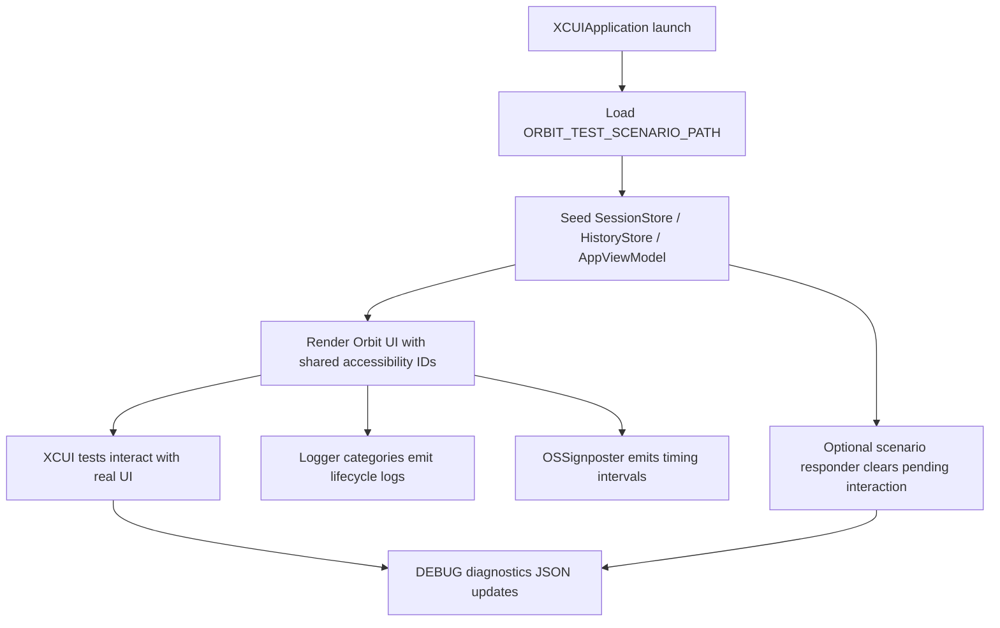
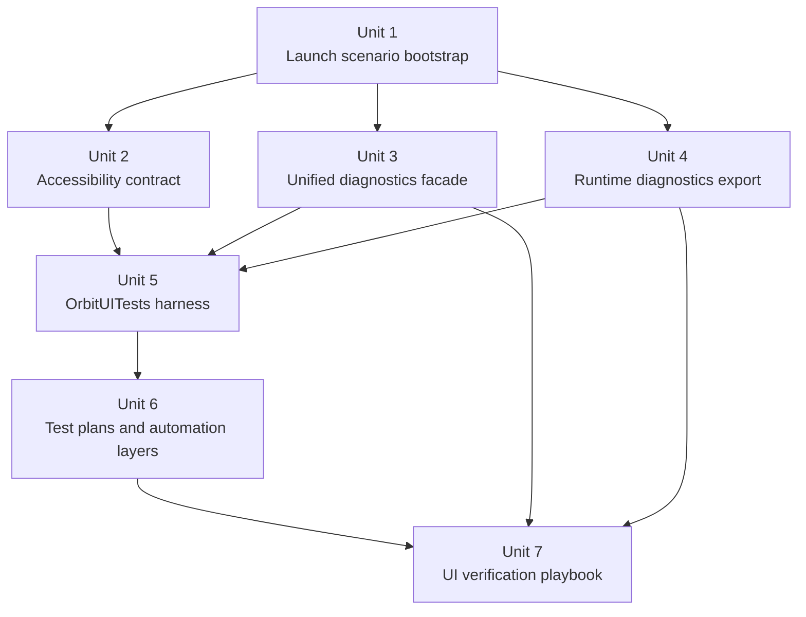
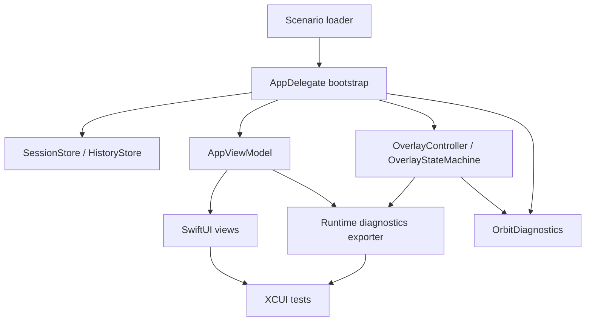

# feat: Build UI testing and diagnostics platform

## Overview

为 Orbit 建立一条可重复、可诊断、可自动化的 UI 验证链路：通过启动时场景文件注入稳定初始状态，使用真实 app 的 `XCTest/XCUIAutomation` 驱动界面，导出 DEBUG 专用结构化运行时诊断，并把统一日志与 signpost 作为失败取证主时间线。

目标不是“补几条 UI case”，而是把当前分散的 UI 测试、日志、状态快照和人工复测经验收束成一套平台化方案，重点覆盖 overlay / permission / onboarding / session-history 这些直接影响 Orbit 可见行为的路径。

## Problem Frame

当前仓库在逻辑层已经有较好的 Swift Testing 覆盖，例如 `OrbitTests/OverlayControllerTests.swift`、`OrbitTests/OverlayStateMachineTests.swift`、`OrbitTests/OverlayRuntimeSnapshotTests.swift` 和 `OrbitTests/CLITests.swift`，但缺少以下关键能力：

- 没有真实 app 级 UI 自动化 target，无法稳定验证“真实窗口 + 真正交互 + 最终可见结果”。
- UI 可定位 contract 几乎不存在，当前只在 `Orbit/Views/PermissionView.swift` 有零散 `accessibilityIdentifier`。
- 诊断面割裂在 `NSLog`、`HookDebugLogger` 和零散快照之间，失败后很难快速回答“UI 为什么长这样”。
- 现有测试入口更偏逻辑注入和 socket 处理，无法作为 macOS UI 层回归验证主路径。

本计划直接基于用户请求和前置工程评审结论制定，没有上游 requirements 文档。产品行为不重新发明；重点是把已有 UI 行为做成可自动验证、可定位失败的系统。

## Requirements Trace

- R1. 为 Orbit 增加真实 app 级 UI 自动化能力，主路径不依赖实时 socket/hook 回放。
- R2. UI 测试必须支持稳定场景注入，能直接启动到 idle / pending permission / onboarding / active sessions / history 等状态。
- R3. 建立 DEBUG 专用结构化诊断出口，至少覆盖 overlay、pending interaction、session/history 摘要、onboarding 和最近一次 hook 决策。
- R4. 统一运行时日志到 `Logger + OSSignposter`，`HookDebugLogger` 保留为 hook 审计 JSONL 辅通道。
- R5. 建立明确的 UI accessibility contract，测试不得依赖易漂移的展示文案。
- R6. 输出分层自动化方案与 UI 验证方案，覆盖本地快速回归、完整回归、失败取证和人工复核。
- R7. 不改变 Orbit 对外 hook/socket 协议，不把测试平台做成新的生产特性。

## Scope Boundaries

- 不重做现有 SwiftUI 视觉设计，也不顺带改 UI 文案。
- 不替换现有 `OrbitTests` 逻辑测试体系，新增平台应复用已有单元与集成测试资产。
- 不引入第三方截图 diff SaaS、外部视觉回归平台或自建复杂录制回放系统。
- 不把 DEBUG 专用测试/诊断面暴露到 release 行为中。

### Deferred to Separate Tasks

- 具体 CI 平台接线如果需要跨仓库或依赖团队既有 runner 策略，可在本仓库测试资产落地后单独推进。
- 更大范围的视觉基线比对（像素级 snapshot diff）不作为第一阶段交付，等 UI contract 和 diagnostics 稳定后再评估。

## Context & Research

### Relevant Code and Patterns

- `Orbit/AppDelegate.swift` 是 app 启动、store 组装、overlay 建立、pending interaction 驱动和 DEBUG 测试入口的组合根。
- `Orbit/AppViewModel.swift` 持有 UI 所需的 session、history、pending interaction、todayStats、onboarding 等内存态。
- `Orbit/OrbitCore/HookDebugLogger.swift` 已经提供 JSONL 审计写入模式，适合作为 hook 侧证据保留通道。
- `Orbit/Overlay/OverlayRuntimeSnapshot.swift` 已经抽象出 overlay 真相快照，是结构化诊断出口的现成种子。
- `OrbitTests/CLITests.swift` 通过 `AppDelegate.processSocketMessageForTesting` 证明 app 级消息处理可以在不走真实 socket 的情况下被验证。
- `Orbit/Views/ExpandedView.swift`、`Orbit/Views/PillView.swift`、`Orbit/Views/SessionTreeView.swift`、`Orbit/Views/HistoryRowView.swift`、`Orbit/Views/OnboardingView.swift`、`Orbit/Views/PermissionView.swift` 构成当前主要可见 UI 面。
- `Orbit.xcodeproj` 当前只有 `OrbitTests`，没有 `OrbitUITests` target，也没有任何 `.xctestplan`。

### Institutional Learnings

- `docs/solutions/` 目前只有 `docs/solutions/runtime-errors/swift-sendable-closure-type-confusion-2026-04-16.md`，与本次 UI 测试/诊断平台无直接复用结论。
- 本次方案应主要依赖现代码结构和 Apple 官方测试/日志能力，而不是复用现有内部方案。

### External References

- Apple Testing overview: https://developer.apple.com/documentation/xcode/testing
- Organizing tests with test plans: https://developer.apple.com/documentation/xcode/organizing-tests-to-improve-feedback
- XCTest / XCUIAutomation: https://developer.apple.com/documentation/xctest/
- XCUIElement querying and waiting: https://developer.apple.com/documentation/xctest/xcuielement
- Attachments in tests: https://developer.apple.com/documentation/xctest/adding-attachments-to-tests-activities-and-issues
- Logger / unified logging: https://developer.apple.com/documentation/os/logger
- OSSignposter: https://developer.apple.com/documentation/os/ossignposter

## Key Technical Decisions

- 使用“真实 app + 启动场景文件注入”作为 UI 自动化主路径，而不是实时 socket/hook 回放。
  原因：UI 自动化最怕时序不确定；场景文件可以把状态准备移到 launch 前后稳定窗口里。

- 新增 `OrbitUITests` target，用 `XCUIApplication` 驱动真实 Orbit 窗口。
  原因：现有单元/集成测试足以覆盖状态机与模型；UI 层需要单独验证真实 accessibility 与窗口行为。

- 新建统一诊断封装，主通道用 `Logger + OSSignposter`，`HookDebugLogger` 继续只做 hook JSONL 审计。
  原因：`HookDebugLogger` 适合记录 hook 事件，但不适合扩张成整个 UI 生命周期总线。

- DEBUG 诊断出口采用“结构化 JSON 文件”方案，通过环境变量指定路径。
  原因：对于 UI tests 来说，文件是最简单、最稳定、最容易在失败后附加保存的诊断介质，不需要引入额外 IPC。

- accessibility identifier 作为稳定 contract 统一收口到一个共享命名空间。
  原因：零散字符串最容易漂移；集中定义才能让 UI tests 和视图代码同步演进。

- 自动化分层使用 `.xctestplan`，至少区分“快速 smoke”与“完整回归/诊断”两类运行面。
  原因：UI tests 天生更慢，必须通过 test plan 控制反馈速度和执行场景，而不是让所有人每次都跑全量。

## Open Questions

### Resolved During Planning

- 场景注入载体是否使用零散 env：否，使用单个场景文件路径，例如 `ORBIT_TEST_SCENARIO_PATH`，避免环境变量矩阵失控。
- 运行时诊断出口是否继续复用 `HookDebugLogger`：否，保留其现职责，新增专门的 UI/runtime diagnostics 聚合导出。
- UI tests 是否以文本 label 为查询主键：否，统一以 accessibility identifier 为主，文本只作为次要断言。
- 回归验证是否只靠截图：否，必须结合结构化 diagnostics JSON 与 unified logging/signpost 时间线。

### Deferred to Implementation

- 结构化 diagnostics JSON 的最终 schema 名称与字段命名可以在实现时微调，但最少字段集合必须满足本计划的验证场景。
- `OrbitUITests` 是否拆成多个 target 不是当前计划决策点；先以一个 target + 多个 test plan 落地。
- pipeline 层是否使用 GitHub Actions、其他 CI，或仅先在本地落地，不影响仓库内测试资产设计。

## Output Structure

```text
docs/
  plans/
    2026-04-19-001-feat-ui-testing-diagnostics-platform-plan.md
  testing/
    ui-automation.md
Orbit/
  AppDelegate.swift
  AppViewModel.swift
  OrbitCore/
    Diagnostics/
      OrbitDiagnostics.swift
      OrbitRuntimeDiagnostics.swift
    Testing/
      AppLaunchScenario.swift
      AppLaunchScenarioLoader.swift
  Overlay/
    OverlayController.swift
    OverlayRuntimeSnapshot.swift
    OverlayStateMachine.swift
  Views/
    ExpandedView.swift
    HistoryRowView.swift
    OnboardingView.swift
    OrbitAccessibilityID.swift
    PermissionView.swift
    PillView.swift
    SessionTreeView.swift
OrbitTests/
  AppLaunchScenarioLoaderTests.swift
  OrbitAccessibilityIDTests.swift
  OrbitDiagnosticsTests.swift
  OrbitRuntimeDiagnosticsTests.swift
OrbitUITests/
  Fixtures/
    active-and-history.json
    idle.json
    onboarding-drift.json
    pending-permission.json
  Support/
    OrbitUITestCase.swift
    ScenarioFixture.swift
  OrbitUISmokeTests.swift
  OrbitUIRegressionTests.swift
Orbit.xcodeproj/
  project.pbxproj
  xcshareddata/
    xcschemes/
      Orbit.xcscheme
    xctestplans/
      Orbit.xctestplan
      OrbitUIRegression.xctestplan
      OrbitUIDiagnostics.xctestplan
```

## High-Level Technical Design

> *This illustrates the intended approach and is directional guidance for review, not implementation specification. The implementing agent should treat it as context, not code to reproduce.*



## Alternative Approaches Considered

- 直接回放真实 socket/hook 流量到 UI tests：放弃。它更接近集成环境，但会把时序、队列和外部 helper 依赖一起带进 UI 自动化，flake 风险过高。
- 只做截图断言，不导出结构化状态：放弃。视觉失败无法解释内部状态，调试成本会持续升高。
- 把所有日志继续堆到 `NSLog` 或 `HookDebugLogger`：放弃。前者缺乏结构化类别，后者职责过窄且语义偏 hook 审计。

## Phased Delivery

### Phase 1

- 场景注入、accessibility contract、统一 diagnostics 封装、结构化 runtime export
- 目的：先把“可被测、可观察、可等待”的基础打稳

### Phase 2

- `OrbitUITests` target、smoke/regression UI suites、test plan 分层
- 目的：把基础设施接成实际自动化回归链路

### Phase 3

- 文档化 UI 验证方案、失败取证方法、后续 CI 接线说明
- 目的：让实现、review、排障和后续接手都不需要重新发明流程

## Implementation Units



- [ ] **Unit 1: Add launch-scenario bootstrap**

**Goal:** 让 Orbit 在 DEBUG/UI test 环境下能通过单个场景文件稳定启动到指定 UI 状态，并支持可交互的 pending interaction 测试场景。

**Requirements:** R1, R2, R7

**Dependencies:** None

**Files:**
- Create: `Orbit/OrbitCore/Testing/AppLaunchScenario.swift`
- Create: `Orbit/OrbitCore/Testing/AppLaunchScenarioLoader.swift`
- Modify: `Orbit/AppDelegate.swift`
- Modify: `Orbit/AppViewModel.swift`
- Modify: `Orbit.xcodeproj/project.pbxproj`
- Test: `OrbitTests/AppLaunchScenarioLoaderTests.swift`

**Approach:**
- 定义 DEBUG 专用场景模型，覆盖 sessions、historyEntries、onboardingState、pendingInteraction、selectedSessionId、todayStats 和可选 overlay intent。
- 通过 `ORBIT_TEST_SCENARIO_PATH` 读取 JSON 场景；正常运行时没有该环境变量则完全保持当前启动路径。
- 场景 loader 负责把数据灌入 `SessionStore` / `HistoryStore` / `AppViewModel`，并为 permission/onboarding 等可交互场景提供测试用 responder，使按钮点击后能够完成状态流转而不依赖真实 socket 返回。
- 明确场景 schema version，避免后续 fixture 演进无约束漂移。

**Execution note:** 先为 loader 和 apply 流程补失败单元测试，再接入 `AppDelegate` 启动路径。

**Patterns to follow:**
- `Orbit/AppDelegate.swift`
- `OrbitTests/CLITests.swift`
- `Orbit/OrbitCore/Models/PendingInteraction.swift`

**Test scenarios:**
- Happy path: 传入有效 `pending-permission.json` 后，app 首帧就显示展开态 permission UI，且不需要任何 socket 输入。
- Happy path: 传入 `active-and-history.json` 后，session tree 与 recent history 同时渲染，计数与 fixture 一致。
- Edge case: fixture 缺少可选字段时，未提供的状态使用现有默认值，app 正常启动。
- Error path: `ORBIT_TEST_SCENARIO_PATH` 指向不存在文件时，app 记录场景加载失败并回退到正常启动。
- Error path: 场景 JSON schema version 不支持时，loader 返回可诊断错误而不是部分应用脏状态。
- Integration: 在 pending interaction 场景中点击 allow/deny 后，pending state 被清理，相关 UI 收起或切换到预期状态。

**Verification:**
- 开发者可以用同一 fixture 多次启动 app，看到一致 UI 结果。
- 单元测试能证明 loader 的解析、应用顺序和错误回退行为稳定。

- [ ] **Unit 2: Establish a shared accessibility contract**

**Goal:** 为 Orbit 可见 UI 建立稳定、集中、可测试的 accessibility identifier 命名空间，供 XCUITest 与人工诊断共同使用。

**Requirements:** R2, R5, R6

**Dependencies:** Unit 1

**Files:**
- Create: `Orbit/Views/OrbitAccessibilityID.swift`
- Modify: `Orbit/Views/PillView.swift`
- Modify: `Orbit/Views/ExpandedView.swift`
- Modify: `Orbit/Views/SessionTreeView.swift`
- Modify: `Orbit/Views/HistoryRowView.swift`
- Modify: `Orbit/Views/OnboardingView.swift`
- Modify: `Orbit/Views/PermissionView.swift`
- Modify: `Orbit.xcodeproj/project.pbxproj`
- Test: `OrbitTests/OrbitAccessibilityIDTests.swift`

**Approach:**
- 将固定 ID 与动态前缀统一定义，例如 overlay root、pill root、expanded root、active section、recent section、permission approve/deny、onboarding retry、session row prefix、history row prefix。
- 优先给“交互控件”和“测试需要等待的状态根节点”加标识，而不是给每个装饰元素都加 ID。
- 动态 row 使用稳定主键派生 identifier，避免依赖展示标题或路径 basename。

**Patterns to follow:**
- `Orbit/Views/PermissionView.swift`
- `Orbit/Views/SessionTreeView.swift`
- `Orbit/Views/HistoryRowView.swift`

**Test scenarios:**
- Happy path: pill、expanded、permission、onboarding 根视图都暴露固定 identifier，可被 UI test 直接查询。
- Happy path: session rows 与 history rows 使用稳定前缀加业务主键生成 identifier。
- Edge case: 多个 session 或 history entry 并存时，identifier 仍然唯一，不因重复标题冲突。
- Integration: UI tests 仅依赖 identifier 完成查询与点击，修改展示文案不会导致定位逻辑失效。

**Verification:**
- `OrbitUITests` 不需要通过硬编码文案或层级位置定位主要控件。
- 新增 contract 测试能快速发现 ID 漂移或重复。

- [ ] **Unit 3: Replace scattered NSLog calls with unified diagnostics**

**Goal:** 建立统一的 `Logger + OSSignposter` 诊断封装，把 overlay、socket、场景加载和 pending interaction 生命周期放进同一时间线。

**Requirements:** R3, R4, R6

**Dependencies:** Unit 1

**Files:**
- Create: `Orbit/OrbitCore/Diagnostics/OrbitDiagnostics.swift`
- Modify: `Orbit/AppDelegate.swift`
- Modify: `Orbit/Overlay/OverlayController.swift`
- Modify: `Orbit/Overlay/OverlayStateMachine.swift`
- Modify: `Orbit/OrbitCore/SocketServer.swift`
- Modify: `Orbit/OrbitCore/HookDebugLogger.swift`
- Modify: `Orbit.xcodeproj/project.pbxproj`
- Test: `OrbitTests/OrbitDiagnosticsTests.swift`

**Approach:**
- 定义统一 subsystem 与 category，例如 `launch`、`overlay`、`hook`、`scenario`、`ui-test`。
- 用轻量 facade 包装 `Logger` 和 `OSSignposter`，避免业务代码直接散落 subsystem/category 常量。
- 为 expand/collapse、pending interaction set/clear、socket message processing、scenario loading 增加 signposted interval/event。
- 保持 `HookDebugLogger` 现有 JSONL schema 和 hook 审计职责，不把 runtime 生命周期事件都塞进去。

**Execution note:** 先为 facade 增加可注入 sink，再迁移现有 `NSLog`，这样单元测试能验证事件分类和元数据。

**Patterns to follow:**
- `Orbit/OrbitCore/HookDebugLogger.swift`
- `Orbit/Overlay/OverlayStateMachine.swift`
- `Orbit/AppDelegate.swift`

**Test scenarios:**
- Happy path: overlay expand/collapse 生命周期事件进入统一 category，并带上 phase / wantExpanded 等关键元数据。
- Happy path: scenario load 与 socket message process 产生可关联的 signpost 区间。
- Edge case: 连续 requestExpand / scheduleCollapse 被状态机短路时，不产生不成对的 signpost 结束事件。
- Error path: socket 启动失败、payload decode 失败、scenario parse 失败使用 error 级别记录，并避免泄露完整敏感内容。
- Integration: 保留 `HookDebugLogger` 后，hook 审计日志仍可写出，且不会改变原本 hook 响应路径。

**Verification:**
- 通过注入 sink 的单元测试可以验证日志分类和 signpost 配对。
- 使用统一 subsystem 过滤时，开发者能在 Console / Instruments 中看到完整时间线。

- [ ] **Unit 4: Export structured runtime diagnostics for UI tests**

**Goal:** 提供 DEBUG 专用、机器可读的 runtime diagnostics JSON，供 UI tests 等待状态、失败留证和人工排障读取。

**Requirements:** R2, R3, R6

**Dependencies:** Unit 1, Unit 3

**Files:**
- Create: `Orbit/OrbitCore/Diagnostics/OrbitRuntimeDiagnostics.swift`
- Modify: `Orbit/AppDelegate.swift`
- Modify: `Orbit/AppViewModel.swift`
- Modify: `Orbit/Overlay/OverlayController.swift`
- Modify: `Orbit/Overlay/OverlayRuntimeSnapshot.swift`
- Modify: `Orbit.xcodeproj/project.pbxproj`
- Test: `OrbitTests/OrbitRuntimeDiagnosticsTests.swift`

**Approach:**
- 聚合 overlay snapshot、pending interaction 摘要、session/history 数量、selected session、onboarding state、最近一次 scenario decision、最近一次 hook 处理摘要到单个 Codable 诊断对象。
- 通过 `ORBIT_TEST_DIAGNOSTICS_PATH` 控制是否导出 JSON；未设置时 exporter 完全禁用。
- 在关键状态变更后更新 JSON 文件，确保 UI tests 可以“等诊断状态”而不是盲等动画时间。
- diagnostics schema 与 UI fixtures 一样做显式 versioning，避免测试辅助代码和 app 演进失配。

**Patterns to follow:**
- `Orbit/Overlay/OverlayRuntimeSnapshot.swift`
- `Orbit/AppViewModel.swift`
- `OrbitTests/OverlayRuntimeSnapshotTests.swift`

**Test scenarios:**
- Happy path: overlay 从 collapsed 进入 expanded 后，diagnostics JSON 反映最新 `phase`、`wantExpanded` 和 `isExpanded`。
- Happy path: permission 场景点击 allow/deny 后，diagnostics JSON 中的 pending interaction 清空，并记录最近一次 decision。
- Edge case: 未设置 `ORBIT_TEST_DIAGNOSTICS_PATH` 时，不创建文件且应用行为无变化。
- Error path: diagnostics 路径不可写时，记录错误日志但不影响 UI 功能。
- Integration: UI tests 通过读取 diagnostics JSON 等到目标状态，而不是使用固定 sleep。

**Verification:**
- UI 测试辅助层能够稳定轮询 diagnostics JSON 并作为断言依据。
- 单元测试覆盖 exporter 的启停、更新与错误处理。

- [ ] **Unit 5: Add OrbitUITests and scenario-driven UI coverage**

**Goal:** 新建真实 app 级 UI 测试 target，并用少量高价值场景覆盖 Orbit 的核心可见行为。

**Requirements:** R1, R2, R3, R5, R6

**Dependencies:** Unit 2, Unit 3, Unit 4

**Files:**
- Create: `OrbitUITests/Support/ScenarioFixture.swift`
- Create: `OrbitUITests/Support/OrbitUITestCase.swift`
- Create: `OrbitUITests/Fixtures/idle.json`
- Create: `OrbitUITests/Fixtures/pending-permission.json`
- Create: `OrbitUITests/Fixtures/onboarding-drift.json`
- Create: `OrbitUITests/Fixtures/active-and-history.json`
- Create: `OrbitUITests/OrbitUISmokeTests.swift`
- Create: `OrbitUITests/OrbitUIRegressionTests.swift`
- Modify: `Orbit.xcodeproj/project.pbxproj`
- Test: `OrbitUITests/OrbitUISmokeTests.swift`
- Test: `OrbitUITests/OrbitUIRegressionTests.swift`

**Approach:**
- 新建 `OrbitUITests` target，基类负责 launch app、注入 scenario/diagnostics 路径、读取 diagnostics JSON、在失败时自动附加截图与诊断文件。
- smoke suite 只保留最小高价值路径：idle、pending permission、onboarding drift、active+history。
- regression suite 在 smoke 基础上加入交互断言，例如 approve/deny 后的状态变化、recent 列表分页、selected session 呈现。
- 所有等待逻辑优先使用 diagnostics 状态和 `waitForExistence`，避免裸 `sleep`。

**Execution note:** 从一条最小 smoke case 起步，先跑通 launch + fixture + diagnostics + screenshot 证据链，再扩展回归用例。

**Patterns to follow:**
- `OrbitTests/CLITests.swift`
- `Orbit/Views/PermissionView.swift`
- `Orbit/Views/ExpandedView.swift`

**Test scenarios:**
- Happy path: `idle.json` 启动后只显示 pill 根视图，expanded 根视图不存在。
- Happy path: `pending-permission.json` 启动后 expanded permission UI 可见，approve/deny 控件可点击。
- Happy path: 点击 permission allow 后，pending UI 消失，diagnostics JSON 记录最近 decision，overlay 收敛到预期状态。
- Happy path: `onboarding-drift.json` 启动后显示 onboarding 卡片与 retry 按钮。
- Happy path: `active-and-history.json` 启动后 active session rows 和 recent history rows 都存在；history 超过默认页大小时显示 more 按钮。
- Edge case: diagnostics 更新较慢时，测试通过 wait helper 轮询状态，不因动画时间小幅波动失败。
- Error path: fixture 路径缺失或 diagnostics 文件未生成时，测试早失败并附带截图、fixture 名称和诊断上下文。
- Integration: UI 可见状态与 diagnostics JSON 的 overlay/session/pending 摘要一致，不出现“UI 看起来对但内部状态错”的假绿。

**Verification:**
- 本地可以稳定运行 smoke suite，失败时自动生成足够的证据附件。
- regression suite 能覆盖用户当前最关注的 overlay / permission / onboarding / history 可见行为。

- [ ] **Unit 6: Layer execution with shared test plans**

**Goal:** 把逻辑测试、smoke UI 测试和完整回归/诊断测试组织成分层 test plan，控制反馈速度和执行成本。

**Requirements:** R1, R6

**Dependencies:** Unit 5

**Files:**
- Create: `Orbit.xcodeproj/xcshareddata/xcschemes/Orbit.xcscheme`
- Create: `Orbit.xcodeproj/xcshareddata/xctestplans/Orbit.xctestplan`
- Create: `Orbit.xcodeproj/xcshareddata/xctestplans/OrbitUIRegression.xctestplan`
- Create: `Orbit.xcodeproj/xcshareddata/xctestplans/OrbitUIDiagnostics.xctestplan`
- Modify: `Orbit.xcodeproj/project.pbxproj`

**Approach:**
- `Orbit.xctestplan` 作为默认快速反馈计划，保留现有 `OrbitTests` 并启用最小 smoke UI 子集。
- `OrbitUIRegression.xctestplan` 启用完整 UI regression 场景，作为预提交或较重的本地回归入口。
- `OrbitUIDiagnostics.xctestplan` 聚焦排障场景，保留附件、日志和 diagnostics 导出配置，方便复现 flaky 行为。
- 把共享 scheme 也纳入版本控制，避免每个开发者本地 scheme 漂移。

**Patterns to follow:**
- Apple test plan 官方组织方式
- 当前 `OrbitTests` target 的组织边界

**Test scenarios:**
- Test expectation: none -- 该单元主要产出测试编排配置，不直接引入新的产品行为。

**Verification:**
- 开发者能清晰区分“默认快速回归”和“完整 UI 回归/诊断”。
- 共享 scheme 与 test plans 入库后，不再依赖个人 `xcuserdata`。

- [ ] **Unit 7: Publish a UI verification and triage playbook**

**Goal:** 把自动化策略、人工验证重点、失败证据读取方式和后续 CI 接线原则固化成仓库文档。

**Requirements:** R6

**Dependencies:** Unit 3, Unit 4, Unit 6

**Files:**
- Create: `docs/testing/ui-automation.md`

**Approach:**
- 记录 fixture 命名规则、diagnostics JSON 用法、test plan 选择建议、推荐验证顺序和失败时应检查的证据。
- 把“自动化能证明什么”和“仍需人工观察什么”拆开写清楚，尤其是 hover/动画细节、窗口位置和视觉精细度。
- 说明 unified logging 的 subsystem/category 约定，以及如何把截图、diagnostics JSON、JSONL hook log 组合成一份失败证据。

**Patterns to follow:**
- 本计划的 Requirements Trace、Key Technical Decisions、Phased Delivery

**Test scenarios:**
- Test expectation: none -- 文档单元不引入运行时行为。

**Verification:**
- 新接手的实现者或 reviewer 可以只看文档就知道该跑哪套验证、怎么看失败、哪些点仍需人工复核。

## System-Wide Impact



- **Affected stakeholders:** end users 通过更稳定的 UI 行为受益；开发者和 reviewer 获得可复现的自动化验证；后续运维/支持在排障时有统一证据链。
- **Interaction graph:** `AppDelegate` 组合根、`AppViewModel` 内存态、overlay 控制器、SwiftUI 视图、UI tests 辅助层和 diagnostics exporter 会形成新的调试闭环。
- **Error propagation:** 场景加载失败、diagnostics 写出失败、UI fixture 缺失都应以“记录错误 + 保持 app 可用/测试早失败”的方式处理，避免 silent failure。
- **State lifecycle risks:** 场景注入和 pending interaction responder 会新增测试态生命周期，必须明确只在 DEBUG/test mode 生效，避免污染正常运行路径。
- **API surface parity:** 新增环境变量和 diagnostics schema 构成外部 contract，应在文档中固定语义，避免后续 UI tests/CI 辅助代码漂移。
- **Integration coverage:** 单元测试继续证明状态机与模型逻辑，UI tests 负责证明“真实界面 + 可交互控件 + 结构化状态 + 证据附件”的跨层连通性。
- **Unchanged invariants:** `/tmp/orbit.sock` 现有 socket 协议、`HookDebugLogger` 的 hook 审计职责、release 版本的默认启动路径与对外行为都不应被改变。

## Success Metrics

- 核心 smoke UI 场景能够在同一台开发机上稳定重复通过，而不是依赖人工 timing。
- 任一 UI 回归失败都至少附带截图、diagnostics JSON 和 unified logging/signpost 上下文三类证据中的两类以上。
- 主要 UI 查询全部通过 shared accessibility identifiers 完成，不依赖展示文案定位。
- 现有 `OrbitTests` 不因新平台引入而退化为只能在测试模式下通过。

## Dependencies / Prerequisites

- Xcode 16+ 与当前仓库的 Swift Testing/XCTest 组合必须保持可用。
- 本地或 CI 运行环境需要允许 macOS UI automation 执行 Orbit app。
- 仓库接受把共享 scheme 和 `.xctestplan` 纳入版本控制，而不是继续依赖个人 `xcuserdata`。

## Risks & Dependencies

| Risk | Mitigation |
|------|------------|
| UI tests 因动画和窗口状态产生 flake | 用 diagnostics 状态等待替代固定 sleep，优先断言状态根节点而非像素瞬时状态 |
| DEBUG 测试支撑代码泄漏到 release 路径 | 所有场景注入和 diagnostics exporter 都置于 `#if DEBUG` 或显式测试模式守卫后 |
| accessibility identifier 漂移导致测试脆弱 | 集中定义 contract，并为固定 ID 和动态前缀添加专门测试 |
| log/signpost 过多导致噪音提升 | 用统一 facade 控制 category 和级别，只给关键状态转移与失败点打点 |
| 新建 `OrbitUITests` 后维护成本过高 | smoke suite 严格控量，回归场景通过 fixture 复用，重型诊断计划只在需要时运行 |
| CI 平台尚未定型 | 先把 test plan 和仓库内资产设计成平台无关，CI 绑定独立收敛 |

## Documentation / Operational Notes

- `docs/testing/ui-automation.md` 应明确区分“自动化必跑项”和“人工视觉复核项”。
- 建议后续把 diagnostics JSON、截图附件和 hook JSONL 统一归档到同一测试工件目录，方便 PR 或 bug 调查引用。
- 如果团队后续接入 CI，应优先跑默认 `Orbit.xctestplan`，完整 `OrbitUIRegression.xctestplan` 作为较重门禁或定时回归。

## Sources & References

- **Origin document:** none — direct-entry planning from the user request and prior engineering review decisions
- Related code: `Orbit/AppDelegate.swift`
- Related code: `Orbit/Overlay/OverlayRuntimeSnapshot.swift`
- Related code: `Orbit/OrbitCore/HookDebugLogger.swift`
- Related code: `OrbitTests/CLITests.swift`
- Related code: `OrbitTests/OverlayControllerTests.swift`
- External docs: https://developer.apple.com/documentation/xcode/testing
- External docs: https://developer.apple.com/documentation/xcode/organizing-tests-to-improve-feedback
- External docs: https://developer.apple.com/documentation/xctest/
- External docs: https://developer.apple.com/documentation/xctest/xcuielement
- External docs: https://developer.apple.com/documentation/xctest/adding-attachments-to-tests-activities-and-issues
- External docs: https://developer.apple.com/documentation/os/logger
- External docs: https://developer.apple.com/documentation/os/ossignposter
