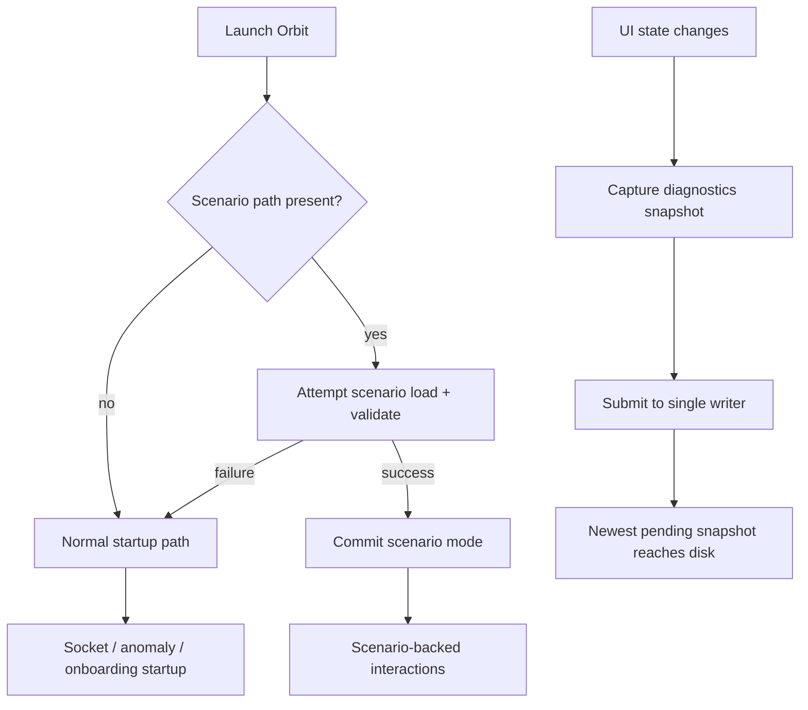

# fix: Close UI testing review findings

## Overview

这是一份针对 2026-04-19 review findings 的 follow-up 修复计划，目标是把已经落地的 UI testing / diagnostics 平台收口到 merge-ready 状态。范围刻意收窄在 review 点名的问题：修复 scenario mode 的启动边界、消除 diagnostics 写盘竞态、统一 UI test contract，并补齐 permission/history 与负路径覆盖。

## Problem Frame

`docs/plans/2026-04-19-001-feat-ui-testing-diagnostics-platform-plan.md` 已经把 Orbit 的 UI 自动化和 runtime diagnostics 平台搭起来了，但 review 证明这套基础设施还有几个不能带着进主分支的问题：

- `ORBIT_TEST_SCENARIO_PATH` 只要存在就会切换到 scenario mode，哪怕 fixture 无效也会跳过正常启动链路。
- runtime diagnostics 当前按状态变化直接 fire-and-forget 写盘，旧快照可能晚于新快照落盘。
- permission 回归只覆盖了 `Allow`，`Deny` 和 `Continue in terminal` 还没有真正的行为回归。
- history 回归仍然依赖展示文案而不是共享 accessibility contract。
- `OrbitUITests` 里重复声明了 accessibility / diagnostics contract，漂移只能在运行时暴露。
- malformed fixture 与 diagnostics failure path 的负路径覆盖还不完整。

这份计划只修这些问题，不重新定义整套平台，也不扩大到新的产品能力。

## Requirements Trace

- R1. Scenario/test bootstrap 只有在成功解析并接受 launch scenario 后才能进入 scenario mode。
- R2. DEBUG runtime diagnostics 导出必须保证 last-state-correct，并在 disabled / unwritable 路径下可恢复。
- R3. Permission 回归必须覆盖 `allow`、`deny`、`passthrough` 三条决策路径。
- R4. History 回归必须改用共享 accessibility contract，而不是展示文案。
- R5. UI automation harness 必须消费 app-owned contract，而不是在 test target 内重写一套镜像定义。
- R6. Review 点名的 malformed fixture 和 diagnostics failure path 都必须有定向覆盖。
- R7. 所有修复必须维持既有 DEBUG/test-only 边界，不把测试平台扩张成新的生产行为。

## Scope Boundaries

- 不重做 overlay、permission、onboarding、session/history 的产品设计或文案。
- 不新增新的测试协议、外部工具链或 CI rollout 方案。
- 不借这次修复顺手做无关重构；只有在 contract 共享或可测性需要时才做最小结构提取。

### Deferred to Separate Tasks

- selected session 的更细粒度 row-level UI 断言，如果修复过程里不是顺手就能拿到，就留给单独任务。
- 更广义的视觉 snapshot / 像素级回归仍然不在这轮范围内。

## Context & Research

### Relevant Code and Patterns

- `docs/plans/2026-04-19-001-feat-ui-testing-diagnostics-platform-plan.md` 是原始平台计划，定义了 DEBUG-only 边界和 accessibility-first 的测试方向。
- `Orbit/AppDelegate.swift` 是 launch-mode resolution、scenario 注入和 runtime diagnostics 调度的组合根。
- `Orbit/OrbitCore/Testing/AppLaunchScenario.swift` 与 `Orbit/OrbitCore/Testing/AppLaunchScenarioLoader.swift` 已经持有 scenario schema 与 validation。
- `Orbit/OrbitCore/Diagnostics/OrbitRuntimeDiagnostics.swift` 已经集中处理 diagnostics JSON 编码与原子写盘，竞态问题主要出在提交语义。
- `Orbit/Views/OrbitAccessibilityID.swift` 已经提供 permission、onboarding、history、load more 等稳定 selector contract。
- `Orbit/Views/ExpandedView.swift` 与 `Orbit/Views/HistoryRowView.swift` 已经挂上 shared accessibility ID，说明 test 侧不该继续用展示文案定位。
- `OrbitUITests/Support/OrbitUITestCase.swift` 与 `OrbitUITests/OrbitUIRegressionTests.swift` 是当前 contract 漂移和回归缺口的主要落点。
- `docs/testing/ui-automation.md` 已经记录了 UI test 运行约束，修复完成后要同步真实 fallback / diagnostics 语义。

### Institutional Learnings

- `docs/solutions/runtime-errors/swift-sendable-closure-type-confusion-2026-04-16.md`
  - 修 diagnostics 提交流程时，优先用单通道 actor / queue 语义收口状态，不要重新引入复杂的跨任务闭包状态捕获。

### External References

- None added. 这是一次 repo-internal remediation，现有代码和原始平台计划里已经足够定义正确实现边界。

## Key Technical Decisions

- Scenario mode 是一个“成功解析后的 launch state”，不是“环境变量存在”的别名。
  原因：无效 fixture 不能改变正常启动路径、临时文件路径选择或 side-effect wiring。

- Diagnostics 写盘要通过一个 writer-owned 串行提交通道收口。
  原因：仅有原子写文件不足以保证 burst 更新时“最后状态赢”。

- UITest harness 直接依赖 app-owned accessibility 与 diagnostics contract。
  原因：contract 漂移应该在编译期或 shared decode 边界上失败，而不是靠 duplicated literal 在运行时踩雷。

- Regression 断言优先使用稳定 ID 和结构化状态，不依赖用户可见 copy。
  原因：review 回归要能抗住文案和布局微调。

- 负路径覆盖是这次修复的一部分，不是后续优化。
  原因：当前未 closure 的 findings 里已经明确包含 malformed 与 failure path。

## Open Questions

### Resolved During Planning

- 这次应该改原始 feature plan 还是新建修复计划？
  新建 follow-up fix plan，让原计划继续充当“最初要建什么”的记录，这份计划专门负责“review 如何收口”。

- 是否需要再引入新的 env var 或 launch mode flag？
  不需要。沿用 `ORBIT_TEST_SCENARIO_PATH`，只收紧它的解释和生效时机。

- history regression 是否保留展示文案选择器作为兜底？
  不保留。展示文案可以作为次要内容断言，但不能再作为主选择器。

### Deferred to Implementation

- diagnostics 是否需要显式序列化 `revision` 字段，还是单通道 coalescing 就够。
  这取决于实现里最小改动的形态，但不会改变整体架构。

- selected session row-level assertion 是否与这次修复同 patch 落地。
  它有价值，但不是关闭当前 review findings 的硬要求。

## System-Wide Impact

- End users：不会引入新的产品能力；主要收益是无效测试环境不再污染正常启动路径。
- Developers：UI tests 改为依赖 shared contract，compile-time 和 targeted test failure 会比运行时漂移更早暴露问题。
- Diagnostics / triage：落盘 JSON 会重新变成可信的“最新状态”证据，而不是可能回退的快照。

## High-Level Technical Design

> *This illustrates the intended approach and is directional guidance for review, not implementation specification. The implementing agent should treat it as context, not code to reproduce.*

## Implementation Units

- [ ] **Unit 1: Harden launch-mode resolution and fallback**

**Goal:** 让 scenario mode 只在 launch scenario 成功解析后生效；fixture 缺失、路径错误或校验失败时，app 完整回退到正常启动路径。

**Requirements:** R1, R7

**Dependencies:** None

**Files:**
- Modify: `Orbit/AppDelegate.swift`
- Modify: `Orbit/OrbitCore/Testing/AppLaunchScenarioLoader.swift`
- Modify: `Orbit/OrbitCore/Testing/AppLaunchScenario.swift`
- Modify: `OrbitTests/AppLaunchScenarioLoaderTests.swift`
- Test: `OrbitTests/AppLaunchScenarioLoaderTests.swift`

**Approach:**
- 把“是否进入 scenario mode”的判断从 `ORBIT_TEST_SCENARIO_PATH != nil` 改成“是否成功解析出 launch scenario”。
- 把 launch-mode resolution 收口成一个可单测的决策点，避免 `AppDelegate` 在加载前就切换 temp-path、store wiring 和 startup 分支。
- 保留场景加载失败的可诊断记录，但失败记录不能替代正常启动流程。
- 继续复用既有 schema / validation 入口，不新建第二套 fixture 校验逻辑。

**Execution note:** 先把 launch-mode resolution 变成可单测决策，再接回 `AppDelegate`，不要用 UI 测试证明纯启动分支判断。

**Patterns to follow:**
- `Orbit/AppDelegate.swift`
- `OrbitTests/CLITests.swift`
- `Orbit/OrbitCore/Testing/AppLaunchScenario.swift`

**Test scenarios:**
- Happy path: 有效 fixture 解析成功时进入 scenario mode，并按场景态初始化 app。
- Edge case: 未设置 `ORBIT_TEST_SCENARIO_PATH` 时保持当前正常启动路径。
- Error path: 路径不存在时记录可诊断错误，但 socket / anomaly / onboarding 正常启动链路不被跳过。
- Error path: schema version 不支持时不应用任何部分场景状态。
- Error path: `invalidPendingInteractionKind` 和 `unsupportedOnboardingState` 都返回明确错误且不会污染 app 初始态。

**Verification:**
- Implementer can show that invalid or absent fixtures no longer change launch branching, temp-path selection, or startup side effects.

- [ ] **Unit 2: Make runtime diagnostics writes last-state-correct**

**Goal:** 消除 diagnostics 写盘竞态，让 burst 更新后磁盘上的 JSON 始终代表最新快照，同时保留失败可恢复性。

**Requirements:** R2, R7

**Dependencies:** Unit 1 not strictly required, but can land independently after launch-mode refactor stabilizes.

**Files:**
- Modify: `Orbit/AppDelegate.swift`
- Modify: `Orbit/OrbitCore/Diagnostics/OrbitRuntimeDiagnostics.swift`
- Modify: `OrbitTests/OrbitRuntimeDiagnosticsTests.swift`
- Modify: `OrbitTests/OrbitDiagnosticsTests.swift`
- Test: `OrbitTests/OrbitRuntimeDiagnosticsTests.swift`
- Test: `OrbitTests/OrbitDiagnosticsTests.swift`

**Approach:**
- 把 `scheduleRuntimeDiagnosticsWrite()` 从 fire-and-forget `Task` 提交改成单通道 writer submit API。
- writer 侧负责串行化、去重或 “latest wins” coalescing；`AppDelegate` 不再直接管理并发写任务生命周期。
- 保持原子文件替换语义，但把“提交顺序正确”作为 writer contract 的一部分。
- disabled writer / unwritable path 要有明确 no-op 或错误恢复语义，避免一次失败后永久失效或崩溃。

**Patterns to follow:**
- `Orbit/OrbitCore/Diagnostics/OrbitRuntimeDiagnostics.swift`
- `Orbit/OrbitCore/Diagnostics/OrbitDiagnostics.swift`

**Test scenarios:**
- Happy path: 连续多次提交不同快照时，最终文件内容等于最后一次提交的状态。
- Edge case: 相同状态被重复提交时不会引入无意义 churn，且最终结果稳定。
- Error path: diagnostics disabled 时提交安全 no-op，不写文件也不抛出未处理错误。
- Error path: 目标路径不可写或写入失败后，后续合法提交仍可继续工作。
- Integration: overlay / pending / session 更新混合触发时，不会出现旧快照覆盖新快照的回退现象。

**Verification:**
- Implementer can demonstrate that rapid consecutive diagnostics submissions converge to the latest snapshot on disk and remain stable after transient write failures.

- [ ] **Unit 3: Unify shared UI automation contracts**

**Goal:** 让 UITest harness 直接消费 app-owned accessibility 和 diagnostics contract，删除 `OrbitUITests` 内的重复定义。

**Requirements:** R4, R5, R7

**Dependencies:** Unit 2, because diagnostics contract wiring should follow the final writer/export surface.

**Files:**
- Modify: `Orbit/Views/OrbitAccessibilityID.swift`
- Modify: `Orbit/OrbitCore/Diagnostics/OrbitRuntimeDiagnostics.swift`
- Modify: `OrbitUITests/Support/OrbitUITestCase.swift`
- Modify: `OrbitTests/OrbitAccessibilityIDTests.swift`
- Modify: `OrbitTests/OrbitRuntimeDiagnosticsTests.swift`
- Modify: `Orbit.xcodeproj/project.pbxproj`
- Test: `OrbitTests/OrbitAccessibilityIDTests.swift`
- Test: `OrbitTests/OrbitRuntimeDiagnosticsTests.swift`

**Approach:**
- 复用已有 `OrbitAccessibilityID` 作为唯一 selector contract，不再保留 `UIID` 镜像枚举。
- 让 UI tests 直接 decode app-owned diagnostics type，或在 app target 内收口一个专供测试导入的共享 DTO；重点是 contract 归属必须在 app 侧。
- 如需 target membership / access control 调整，只做最小可见性提升，避免把 DEBUG-only testing contract 扩散成公开产品 API。
- 保留测试端帮助方法，但帮助方法只包装 shared contract，不重新声明它。

**Patterns to follow:**
- `Orbit/Views/OrbitAccessibilityID.swift`
- `OrbitTests/OrbitAccessibilityIDTests.swift`

**Test scenarios:**
- Happy path: UITest harness 通过 app-owned accessibility ID 定位 permission / onboarding / history controls。
- Happy path: UITest harness 成功用 shared diagnostics contract 解码最新 JSON payload。
- Error path: 若 accessibility ID 或 diagnostics schema 漂移，编译或测试在 shared contract 边界处直接失败，而不是静默使用陈旧镜像字符串。

**Verification:**
- Implementer can remove duplicated identifier/payload definitions from `OrbitUITests` without losing selector ergonomics or diagnostics parsing.

- [ ] **Unit 4: Close regression gaps for permission and history flows**

**Goal:** 把 review 点名的 permission 分支缺口和 history 文案依赖一起收口，让回归测试真正覆盖行为而不是覆盖表面存在性。

**Requirements:** R3, R4, R6

**Dependencies:** Units 1-3

**Files:**
- Modify: `OrbitUITests/OrbitUIRegressionTests.swift`
- Modify: `OrbitUITests/OrbitUISmokeTests.swift`
- Modify: `OrbitUITests/Fixtures/pending-permission.json`
- Modify: `OrbitUITests/Fixtures/active-and-history.json`
- Modify: `OrbitUITests/Support/OrbitUITestCase.swift`
- Test: `OrbitUITests/OrbitUIRegressionTests.swift`
- Test: `OrbitUITests/OrbitUISmokeTests.swift`

**Approach:**
- 把 permission regression 从单一路径扩展为 `allow` / `deny` / `passthrough` 三个可断言结果的回归用例。
- 历史列表回归全部改用 `OrbitAccessibilityID.Expanded.recentLoadMoreButton` 和 `OrbitAccessibilityID.History.row(sessionID:)` 等稳定 ID 定位。
- 对 permission 分支的断言优先使用 pending state 清理和 diagnostics / shared contract 结果，不依赖按钮文案本身。
- 如场景 fixture 需要补充明确 session ID / decision 观测点，只改最少 fixture 数据，不新增第二套测试协议。

**Patterns to follow:**
- `Orbit/Views/ExpandedView.swift`
- `Orbit/Views/HistoryRowView.swift`
- `Orbit/Views/PermissionView.swift`

**Test scenarios:**
- Happy path: 点击 allow 后 pending permission 消失，diagnostics 反映允许决策已被消费。
- Happy path: 点击 deny 后 pending permission 消失，diagnostics 反映拒绝决策已被消费。
- Happy path: 点击 passthrough 后 pending permission 消失，diagnostics 反映 terminal continuation 决策已被消费。
- Happy path: history load more 使用稳定按钮 ID 触发，目标 history row ID 从不存在变为存在。
- Edge case: 文案发生变化但 accessibility contract 不变时，history regression 仍然通过。

**Verification:**
- Implementer can point to regression cases that fail if permission deny/passthrough clearing breaks or if history selectors drift away from shared IDs.

- [ ] **Unit 5: Backfill negative-path coverage and operator docs**

**Goal:** 用定向单测和文档把 review 里剩余的 failure-mode 风险固定下来，避免问题以“非主路径”名义再次漏出。

**Requirements:** R2, R6, R7

**Dependencies:** Units 1-4

**Files:**
- Modify: `OrbitTests/AppLaunchScenarioLoaderTests.swift`
- Modify: `OrbitTests/OrbitRuntimeDiagnosticsTests.swift`
- Modify: `OrbitTests/OrbitDiagnosticsTests.swift`
- Modify: `docs/testing/ui-automation.md`
- Test: `OrbitTests/AppLaunchScenarioLoaderTests.swift`
- Test: `OrbitTests/OrbitRuntimeDiagnosticsTests.swift`
- Test: `OrbitTests/OrbitDiagnosticsTests.swift`

**Approach:**
- 为 loader 补齐 malformed fixture 分支覆盖，确保 review 点名的校验分支都有单测锚点。
- 为 diagnostics 补齐 disabled / unwritable / recover-after-failure 覆盖，确保 writer contract 有负路径证明。
- 文档只同步修复后的真实行为：scenario fallback 语义、diagnostics write guarantees、UI test contract 使用方式；不扩展成新的运行手册。

**Patterns to follow:**
- `docs/testing/ui-automation.md`
- `OrbitTests/AppLaunchScenarioLoaderTests.swift`

**Test scenarios:**
- Error path: malformed fixture 中的 invalid pending interaction kind 触发明确失败。
- Error path: malformed fixture 中的 unsupported onboarding state 触发明确失败。
- Error path: diagnostics disabled 时无输出文件产生且流程安全结束。
- Error path: diagnostics path 不可写时返回或记录预期失败，并且恢复到可写路径后仍能成功导出。
- Integration: 文档描述的 fallback 和 diagnostics 语义与测试中实际验证的行为一致。

**Verification:**
- Implementer can show that each review-noted negative path is now backed by a deterministic test and that `docs/testing/ui-automation.md` matches the repaired behavior.

## Dependencies / Sequencing

1. Unit 1 first, because launch-mode resolution defines whether the DEBUG/test-only boundary is still correct.
2. Unit 2 next, so diagnostics semantics are stable before tests bind to them.
3. Unit 3 after Unit 2, to point the UITest harness at the final contract surface.
4. Unit 4 then closes the user-facing regression gaps using the shared contracts.
5. Unit 5 finishes by locking negative paths and docs to the repaired behavior.

## Risk Analysis & Mitigation

- Risk: tightening scenario fallback hides useful failure evidence.
  Mitigation: keep explicit diagnostics/logging for scenario load failure while separating it from launch-mode selection.

- Risk: over-correcting diagnostics serialization could drop intermediate states that matter for debugging.
  Mitigation: make the disk artifact explicitly represent “latest state”, and keep unified logs / signposts as the fine-grained timeline.

- Risk: sharing contract types across app and UITests may force awkward access-control changes.
  Mitigation: prefer minimal visibility or target-membership adjustments over new mirror types; keep DEBUG-only scope tight.

- Risk: permission regressions may expose latent responder bugs rather than simple test gaps.
  Mitigation: treat responder fixes as part of the same patch only when required to make the covered behavior correct.

## Success Metrics

- Invalid `ORBIT_TEST_SCENARIO_PATH` no longer suppresses normal app startup behavior.
- Repeated diagnostics submissions always leave the latest expected snapshot on disk.
- `OrbitUITests` compiles and runs without locally duplicated accessibility or diagnostics contracts.
- Permission `allow` / `deny` / `passthrough` and history `load more` all have stable regression coverage tied to shared IDs/state instead of display copy.

## Future Considerations

- 如果 UI regression 继续扩展，selected session highlight 和更丰富的 row-level state 断言应建立在 shared ID contract 之上，而不是回退到视觉文案匹配。
- 如果 diagnostics 消费方未来超出本地 UI tests，再考虑清晰版本化 DTO 边界；这次修复不预优化这件事。
